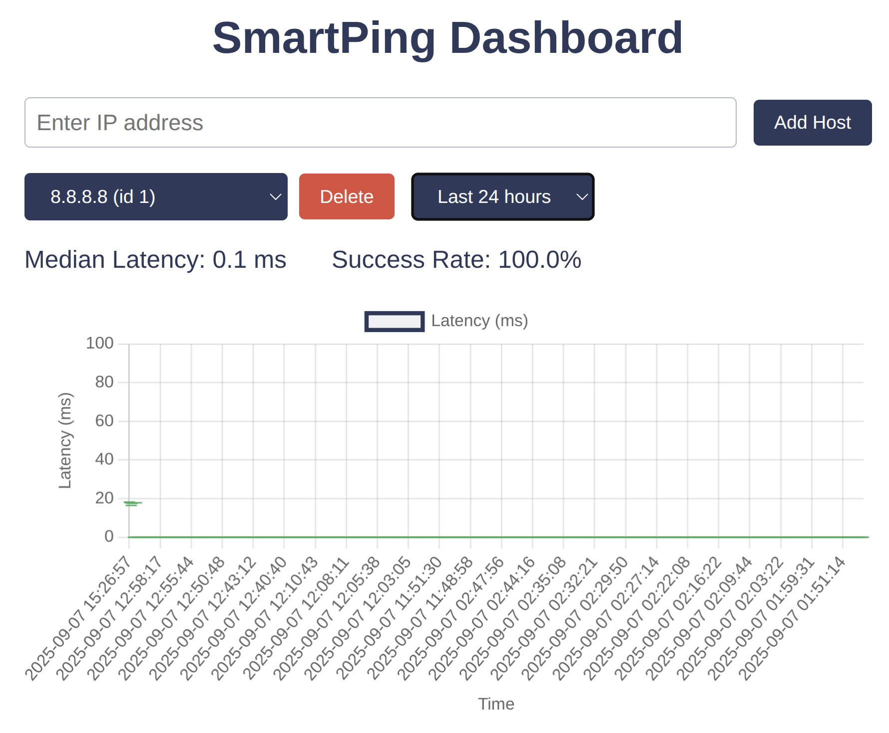

# SmartPing

SmartPing is a lightweight, containerized network latency monitor inspired by [SmokePing](https://oss.oetiker.ch/smokeping/).  
It pings hosts at regular intervals, records results in SQLite, and displays latency/uptime in a simple web dashboard.

⚠️ Disclaimer: SmartPing is a learning/portfolio project. It is not production-ready and is provided as-is without warranty.

## Features
- Median latency measurement (burst of 20 pings every 5 minutes)
- Web dashboard built with Chart.js
- Add or remove hosts easily
- Fully containerized with Docker

## About This Project
This project was built as a learning portfolio piece. I used AI coding assistants to:

- Design the monitoring approach (ping bursts, median aggregation, data retention)  
- Understand the architecture (backend, frontend, database, containers)  
- Practice automation and system design skills that apply directly to network engineering  

The goal isn’t to showcase polished software engineering, but to demonstrate how I can learn quickly, adapt tools, and apply automation concepts.

## Screenshot



## Usage


```bash
# Clone the repo
git clone https://github.com/chriskmurray/smartping.git
cd smartping

# Start containers
docker compose up --build
